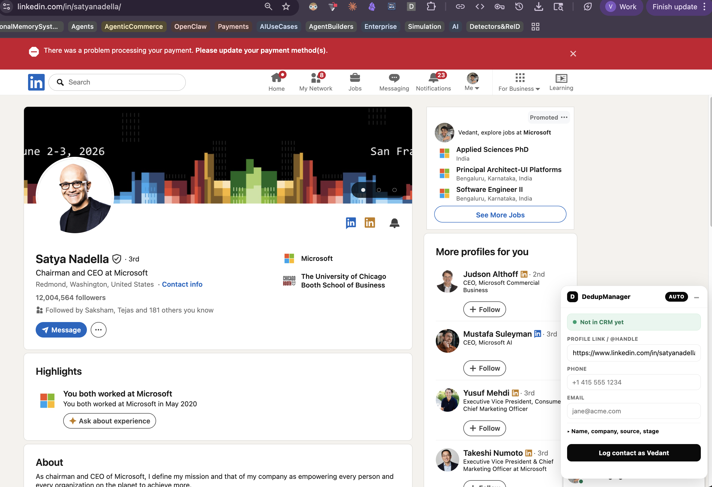
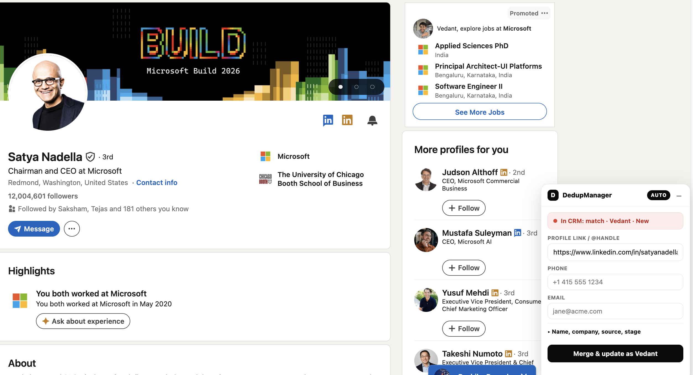
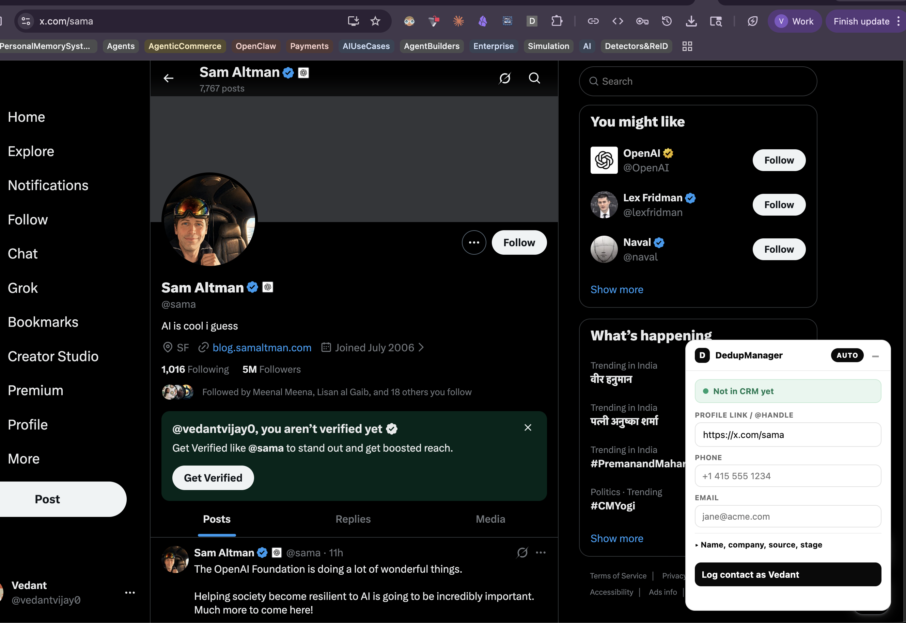
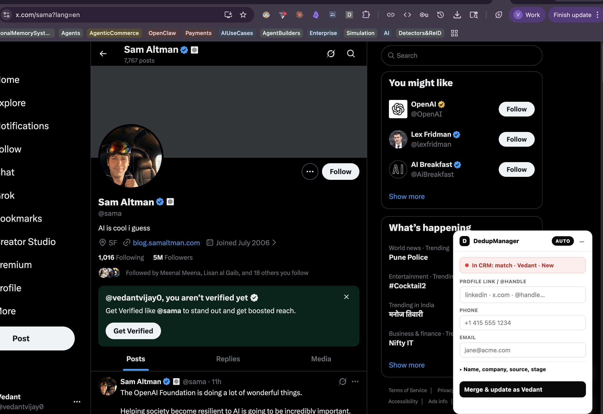
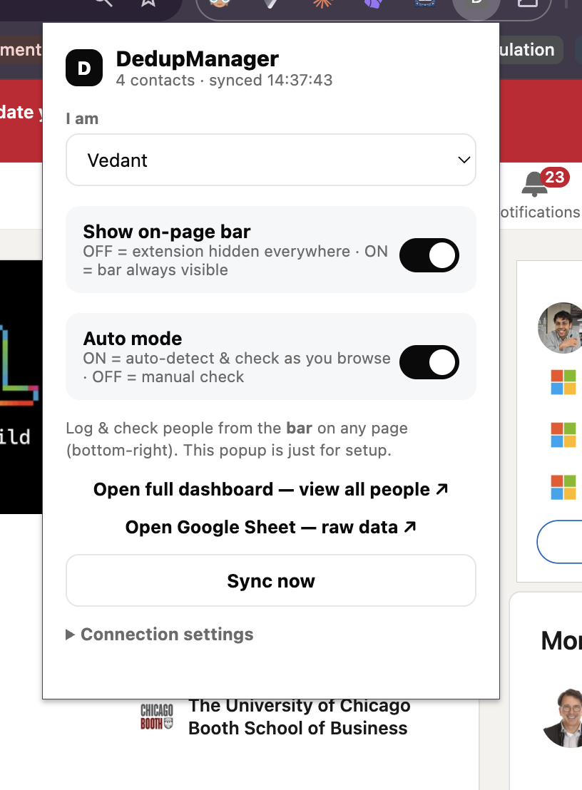
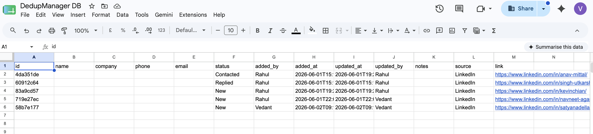

# DedupManager

**A mini shared CRM that lives entirely inside a Google Sheet.**
Open a LinkedIn / X / Gmail / Instagram / Reddit / GitHub profile and a little bar tells you instantly — 🟢 *nobody's reached out* or 🔴 *a teammate already did* — so your team never cold-messages the same person twice.

> No servers. No signups. No database to run. Just a Chrome extension + one Google Sheet.

---

## ✨ What it is

- 🧑 **A real mini-CRM** — one row per person: name, phone, LinkedIn/handle, email, stage, owner, notes.
- 🟢 **Live dedup while you browse** — auto-detects who you're viewing and checks the shared sheet **live**, so a teammate's just-added lead shows up immediately.
- 🔗 **Smart matching** — normalizes messy data: `+1 (415) 555-1234` == `4155551234`, LinkedIn URL junk ignored, `Jane@Acme.com` == `jane@acme.com`.
- 🏷️ **Pipeline stages + your own columns** — add call notes / insights right in the Sheet; the app keeps them.
- 👥 **Shared in one paste** — teammates import a single invite code. No Google login, no setup.
- 💸 **$0 and zero infrastructure** — the Sheet is the database, Apps Script is the (serverless) backend.

---

## 🧩 How it's built — a UI on top of a Google Sheet

```
   Chrome extension  ─┐
   (frontend)         │   one HTTPS call (read / write)
                      ├──────────────►   Apps Script web app   ───►   Google Sheet
   Web dashboard  ────┘                  (serverless backend)         (the database)
   (frontend)
```

In plain English: the **extension and dashboard are the frontends**; the **Apps Script web app is a serverless backend** that runs only when called (a few milliseconds, then it's gone); the **Google Sheet is the database**. The whole thing rides on **Google Workspace's own authentication, permissions, and sharing** — which is why there's nothing to host and almost no auth code to write.

| Layer | What powers it |
|---|---|
| **Frontend** | Chrome extension (Manifest V3) + an Apps Script-served web dashboard |
| **Backend** | Google Apps Script — serverless, runs per request |
| **Database** | A Google Sheet (`Contacts` + `Settings` tabs) |
| **Auth & sharing** | Google Workspace deploy permissions + a shared team key |
| **Matching engine** | Plain JS, shared by the extension and the backend |

---

## 📸 See it

**Same profile, two states** — the bar reads the shared sheet **live**: 🟢 *not in CRM* (left) → 🔴 *already approached by a teammate* (right).

**Satya Nadella — on LinkedIn:**

| 🟢 Not in CRM | 🔴 In CRM (Vedant · New) |
|:---:|:---:|
|  |  |

**Sam Altman — on X/Twitter:**

| 🟢 Not in CRM | 🔴 In CRM (Vedant · New) |
|:---:|:---:|
|  |  |

**Your controls, and your data — it's just a Google Sheet you own:**

| Extension popup | The Google Sheet (the database) |
|:---:|:---:|
|  |  |

---

## 💪 Why it's neat

It's essentially **a clean UI on top of a spreadsheet** — but that spreadsheet is a managed database, and **Apps Script is a free serverless runtime that ships natively with Google Workspace's permissioning and sharing.** So you get a genuine multi-user tool with **no servers, no database to operate, no hosting bill, and almost no auth to write** — Google donates all of it. Build the app; Workspace handles the rest.

---

## 👥 Who it's for

✅ **Use it if you:** are a small team (2–5) splitting cold outreach across LinkedIn / email / etc., want your data in a plain Google Sheet you control, and want zero infrastructure.

🚫 **Skip it if you:** need a full CRM with pipeline automation, want thousands of external users, or need fine-grained per-row permissions — that's a job for a real backend.

---

## 🚀 Get started

One person sets up the shared sheet (~10 min); everyone else joins in ~1 minute by pasting an invite code.

→ **Full step-by-step in [USAGE.md](USAGE.md)** (requirements, host setup, and how teammates join).

---

## 🚧 Status

Working v0.1 — extension, dashboard, and serverless backend all live; dedup engine unit-tested. Built for one team — fork it for yours.

📖 More: **[USAGE.md](USAGE.md)** · [design spec](docs/superpowers/specs/2026-06-01-dedupmanager-design.md) · [LICENSE](LICENSE)
